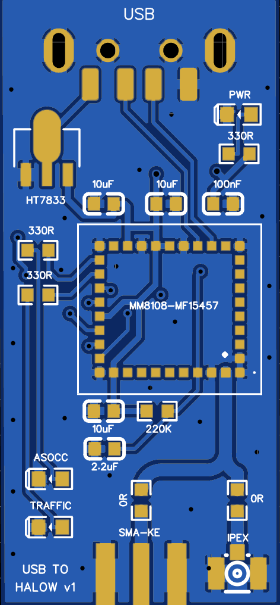
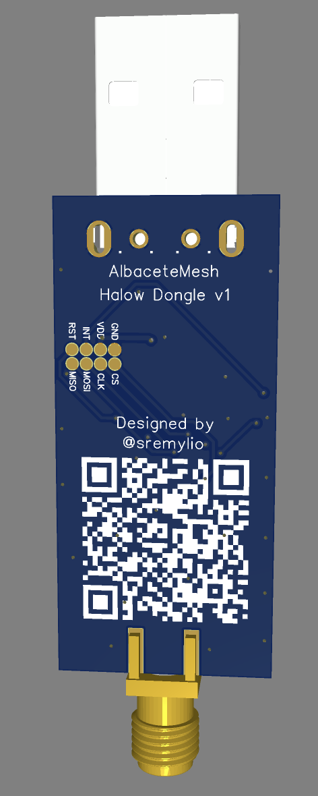

Open-source USB to WiFi HaLow (IEEE 802.11ah) adapter based on Morse Micro MM8108-MF15457 module. Designed for long-range IoT connectivity and mesh networks.

## ✨ Features

- **Long Range**: 1+ km with external antenna
- **Sub-GHz Operation**: 868 MHz (EU band)
- **High Data Rate**: Up to 43.3 Mbps
- **USB Interface**: USB 2.0 High-Speed (480 Mbps)
- **Low Power**: ~500mA typical consumption
- **Standard WiFi**: Full IEEE 802.11ah protocol support
- **Security**: WPA3 support

## 📊 Specifications

| Parameter | Value |
|-----------|-------|
| Module | Morse Micro MM8108-MF15457 |
| Frequency | 868 MHz (EU) |
| Range | 1+ km |
| Data Rate | Up to 43.3 Mbps |
| Interface | USB 2.0 High-Speed |
| Power Supply | 5V via USB |
| Current | ~500mA max |
| PCB Layers | 2 |
| PCB Thickness | 1.0mm |
| Antenna | SMA connector |
| Dimensions | [TBD] mm |

## 🎯 Use Cases

- Long-range IoT gateways
- Mesh networking (Meshtastic-compatible)
- Agricultural sensor networks
- Rural internet connectivity
- Smart city deployments
- Research and development

## 🚀 Quick Start

### 1. Order PCBs

Upload gerber files from `hardware/pcb/gerbers/` to [PCBWAY](https://pcbway.com)

**Important settings:**
- PCB Thickness: **1.0mm**
- Layers: 2
- Surface Finish: ENIG (recommended) or HASL

### 2. Order Components

See BOM in `hardware/bom/BOM.csv` for complete parts list.

**Key components:**
- MM8108-MF15457 module (Morse Micro)
- HT7833 LDO regulator
- SMA edge mount connector
- Passive components (capacitors, resistors)

### 3. Assembly

Follow the assembly guide in `docs/assembly-guide.md`

**Note**: MM8108 module requires hot air soldering or reflow oven.

### 4. Firmware Setup

See `firmware/setup-guide.md` for configuration instructions.

## 📐 PCB Design Notes

### RF Design
- **Trace width**: 1.0mm (50Ω impedance-matched for 1.0mm PCB)
- **Trace length**: <20mm (minimized for low loss)
- **GND plane**: Solid copper pour on bottom layer
- **GND vias**: Stitching vias every 10-15mm around RF section
- **Clearance**: 1.0mm around RF traces

### Layout Optimizations
- Short RF path from module to SMA connector
- 45° angles on RF traces (no 90° corners)
- Decoupling capacitors close to power pins
- Separate analog and digital grounds

## 🔧 Hardware Revisions

### v1.0 (Current)
- Initial prototype design
- 868 MHz EU band
- USB 2.0 interface
- 2-layer PCB

## 📄 License

- **Hardware**: [CERN Open Hardware Licence Version 2 - Permissive](LICENSE-hardware)
- **Documentation**: [CC BY-SA 4.0](LICENSE-docs)

## 🤝 Contributing

Contributions welcome!

- Report bugs via [GitHub Issues](../../issues)
- Suggest features via [GitHub Discussions](../../discussions)
- Submit improvements via Pull Requests

## 🌐 Resources

### WiFi HaLow
- [WiFi Alliance HaLow](https://www.wi-fi.org/discover-wi-fi/wi-fi-halow)
- [IEEE 802.11ah Standard](https://standards.ieee.org/standard/802_11ah-2016.html)

### Morse Micro
- [MM8108 Product Page](https://www.morsemicro.com/products/mm8108)
- [MM8108 Datasheet](https://www.morsemicro.com/resources)
- [Developer Resources](https://www.morsemicro.com/developers)

## ⚠️ Status

**Current Status**: Prototype / Testing

- ✅ Schematic complete
- ✅ PCB layout complete
- ✅ RF design validated
- ⏳ Prototype fabrication pending
- ⏳ Testing and validation
- ⏳ Firmware integration

## 📬 Contact

- **GitHub Issues**: Bug reports and feature requests
- **GitHub Discussions**: General questions and community chat

## 🙏 Acknowledgments

- Morse Micro for MM8108 module documentation
- PCBWAY for PCB manufacturing
- EasyEDA for PCB design tools
- Meshtastic community for inspiration

## ⭐ Star History

If you find this project useful, please consider giving it a star!

---

**Disclaimer**: This is a hobby project. Use at your own risk. Ensure compliance with local radio regulations before operation.

Built with ❤️ for the open-source hardware community
